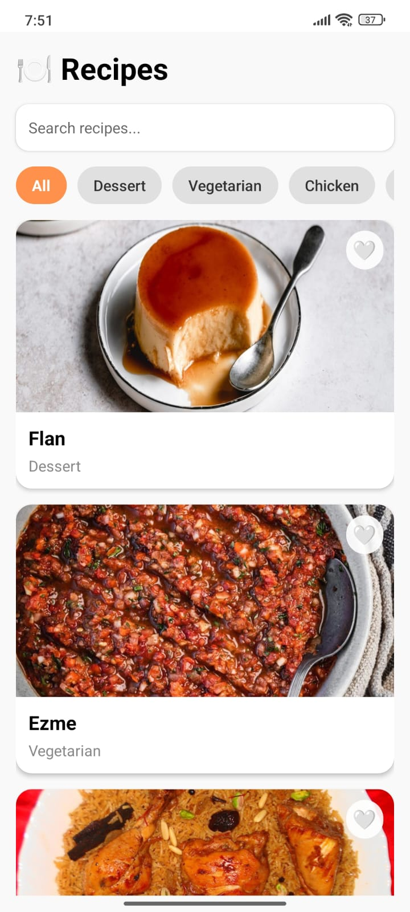

# 🍳 MealMate

**MealMate** is a React Native recipe app built with **Expo Router**.  
Discover delicious recipes from around the world, search by name, filter by category, and save your favorite meals. Perfect for cooking inspiration anytime!

---

## 📸 Screenshots

**Home Page**  

**Details Page**  

---

## 🚀 Features

- Browse recipes from **TheMealDB API** 🌐  
- Search recipes by name 🔍  
- Filter recipes by categories 📂  
- Save your **favorite recipes** ❤️  
- Clean, modern, and responsive UI 🖌️  
- Smooth animations with `react-native-reanimated` ✨  
- Works on **iOS**, **Android**, and **Web** 🌎  

---

